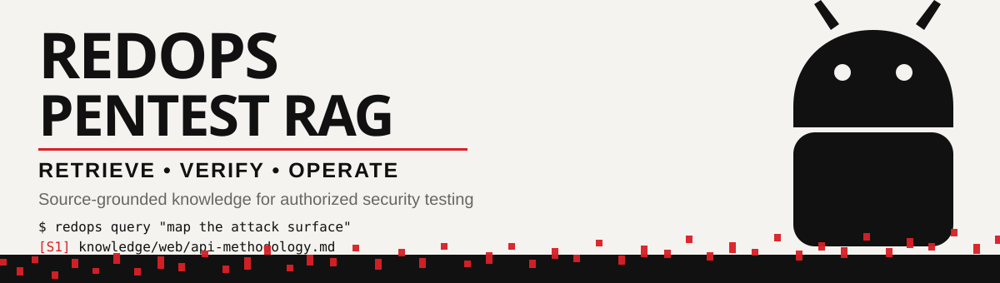

<h1 align="center">
  <br>
</h1>

<h4 align="center">Source-grounded pentest knowledge, agent workflows, and safe tool execution in one local-first framework.</h4>

<p align="center">
  
  
  
  
  
</p>

<p align="center">
  <a href="#features">Features</a> •
  <a href="#installation">Installation</a> •
  <a href="#quick-start">Quick Start</a> •
  <a href="#agent-cli-integrations">CLI Integrations</a> •
  <a href="#safety-boundary">Safety</a>
</p>

---

RedOps adalah framework RAG lokal untuk knowledge pentest yang dapat ditelusuri kembali
ke sumbernya. Gunakan hanya pada sistem yang Anda miliki atau memiliki izin eksplisit
untuk diuji.

## Features

- ingestion Markdown yang idempotent dan heading-aware;
- hybrid retrieval: SQLite FTS5 + cosine vector dengan reciprocal-rank fusion;
- embedding hashing lokal tanpa API sebagai konfigurasi awal;
- adaptor embedding dan chat API yang kompatibel dengan OpenAI;
- jawaban dengan sitasi dan fallback extractive saat tidak ada LLM;
- CLI dan REST API FastAPI;
- backend eksekusi tool lokal atau Exegol dengan argv aman tanpa shell;
- profil agent mobile untuk workflow Android/iOS berbasis Mobile-ReverseSkill;
- provenance berupa judul, heading, path lokal, dan URL asli;
- provider registry untuk local extractive, OpenAI, Z.ai, DeepSeek, dan OrcaRouter;
- installer adapter untuk Codex, Claude CLI, dan OpenCode;
- bounded WAF timing benchmark dengan guardrail anti-DoS.

## Installation

RedOps dapat dipasang sebagai CLI mandiri dengan Python 3.11+:

```bash
pipx install git+https://github.com/alvinhayy/RedOps.git
# atau dari checkout lokal:
pip install -e '.[dev]'
```

Periksa instalasi dan daftar provider:

```bash
redops --help
redops providers
```

## Quick Start

Persyaratan: Python 3.11+ dan SQLite yang mendukung FTS5.

```bash
python -m venv .venv
source .venv/bin/activate
pip install -e '.[dev]'
cp .env.example .env
redops ingest
redops stats
redops query "Bagaimana melakukan enumerasi Active Directory?"
```

Variabel `.env` tidak otomatis dimuat oleh aplikasi. Ekspor variabel yang diperlukan,
atau jalankan dengan alat seperti `dotenv`/Docker Compose. Default aman dan lokal bisa
langsung dipakai tanpa `.env`.

## Agent CLI Integrations

Installer membuat skill/command kecil yang memanggil CLI RedOps, tanpa menyalin secret
atau mengubah konfigurasi provider. Jalankan dry-run lebih dahulu:

```bash
redops install-cli all --dry-run
redops install-cli codex
redops install-cli claude
redops install-cli opencode
```

Target default adalah `~/.codex`, `~/.claude`, dan `~/.config/opencode`. Override path
dengan `CODEX_HOME`, `CLAUDE_HOME`, atau `OPENCODE_HOME`; gunakan `--force` hanya jika
ingin mengganti adapter RedOps yang sudah ada. Detail command dan provider tersedia di
[`docs/providers.md`](docs/providers.md). Setelah instalasi, restart CLI terkait agar
skill/command baru dimuat.

Untuk menjalankan API:

```bash
redops serve --host 0.0.0.0 --port 8000
curl -s http://localhost:8000/health
curl -s http://localhost:8000/v1/query \
  -H 'content-type: application/json' \
  -d '{"question":"Jelaskan jalur enumerasi LDAP", "top_k":6}'
```

Dokumentasi interaktif tersedia di `http://localhost:8000/docs`.

## Exegol Tool Execution

Exegol harus sudah terpasang dan container telah disiapkan sesuai dokumentasi resmi
di [docs.exegol.com](https://docs.exegol.com/). Gunakan hanya terhadap target dengan
otorisasi tertulis. RedOps tidak mengubah isolasi, jaringan, atau hak akses Exegol.

```bash
export REDOPS_EXECUTION_BACKEND=exegol
export REDOPS_EXEGOL_CONTAINER=redops
export REDOPS_EXEGOL_IMAGE=full
export REDOPS_EXEGOL_TIMEOUT=120
redops exegol status
redops exegol exec -- nmap -sV 192.0.2.10
```

`redops exegol exec -- ...` meneruskan setiap argumen sebagai daftar argv dan tidak
menjalankan shell. `REDOPS_EXEGOL_TMP=true` meneruskan opsi temporary container dan
`REDOPS_EXEGOL_VERBOSE=true` meneruskan verbose ke Exegol. Backend default tetap `local`;
set `REDOPS_EXECUTION_BACKEND=exegol` secara eksplisit untuk menggunakan Exegol.

## Agent mobile

Gunakan [`agents/mobile.md`](agents/mobile.md) dan [dokumentasi mobile](docs/mobile-agent.md)
untuk workflow APK/AAB/IPA: detect stack, static analysis, attack-surface review,
vulnerability hunt, konfirmasi Frida/Exegol di lab lokal, dan fuzzing native
opsional pada emulator offline. Static analysis tidak menjalankan aplikasi target;
semua pengujian harus memiliki otorisasi tertulis.

Runtime Android bersifat opsional dan memakai server eksternal
[`uiautomator2-mcp`](docs/MCP-SETUP.md). Exegol MCP tetap tersedia untuk tool dalam
container terisolasi. Tidak ada dependency MCP atau token yang ditambahkan ke
instalasi default.

Routing connector opsional Burp, Camoufox, Ghidra, radare2, dan terminal bounded
untuk mobile tersedia di [`docs/mcp-tools.md`](docs/mcp-tools.md), dengan template
non-secret [`.mcp.json.example`](.mcp.json.example). BloodHound dicadangkan untuk
agent AD/identity, bukan mobile. Kebijakan tetap Exegol-first.

### MCP Exegol

Untuk produksi, gunakan paket resmi Exegol MCP (`pipx install exegol-mcp`) dan
ikuti `exegol-mcp --print-config`. Endpoint HTTP dan bearer token harus dikelola
oleh secret manager atau environment eksternal; RedOps tidak menyimpan token.
RedOps menyediakan adapter stdio opsional yang tipis:

```bash
export REDOPS_EXECUTION_BACKEND=exegol
redops exegol-mcp
```

Adapter hanya menyediakan `exegol_status` dan `exegol_exec` (command wajib berupa
list argv, tanpa shell). Contoh konfigurasi klien:

```json
{"mcpServers":{"redops-exegol":{"command":"redops","args":["exegol-mcp"]}}}
```

## Model Providers

RedOps mendukung provider yang tersedia di konfigurasi OpenCode: local extractive, OpenAI,
Z.ai/GLM, DeepSeek, dan OrcaRouter. Lihat [docs/providers.md](docs/providers.md) untuk
environment variable, model selector, dan command CLI masing-masing provider. Registry dapat
dilihat tanpa menampilkan secret:

```bash
redops providers
redops providers --json
```

## WAF Timing Benchmark (Bounded)

RedOps menyediakan benchmark timing untuk target yang telah diotorisasi. Amplifikasi
hanya memakai URL response yang dipilih eksplisit, maksimum 30 sampel, delay minimum
100 ms, dan batas ukuran response. Payload besar, POST/DoS, IP rotation, dan cross-site
timing tidak diimplementasikan. `--lab-mode` hanya memperbolehkan amplifier lokal/private
atau URL yang dimasukkan ke allowlist untuk staging/lab milik sendiri.

```bash
redops waf benchmark \
  --baseline-url https://staging.example.test/normal \
  --test-url https://staging.example.test/test \
  --amplifier-url https://staging.example.test/long-response \
  --allowlist https://staging.example.test/ --samples 10 --delay 1
```

Gunakan hanya pada aplikasi milik sendiri atau engagement dengan izin tertulis.

Default `hash` bersifat ringan dan cukup untuk bootstrap, tetapi model embedding khusus
akan meningkatkan relevansi semantik. Endpoint OpenAI resmi maupun server lokal yang
menyediakan API kompatibel dapat digunakan:

```bash
export REDOPS_EMBEDDING_PROVIDER=openai
export REDOPS_EMBEDDING_MODEL=text-embedding-3-small
export REDOPS_LLM_PROVIDER=openai
export REDOPS_LLM_MODEL=gpt-4.1-mini
export REDOPS_API_BASE_URL=https://api.openai.com/v1
export REDOPS_API_KEY='...'
redops ingest --force
redops query "Apa indikator delegation yang berisiko?"
```

Jangan commit API key. Perubahan provider/model/dimensi embedding memerlukan
`redops ingest --force` agar query dan index tetap konsisten.

## Knowledge Format

Semua `knowledge/**/*.md` akan diindeks. Front matter berikut direkomendasikan agar
sitasi mengarah ke sumber asli:

```markdown
---
title: Kerberos Delegation
source_url: https://example.org/original-page
fetched_at: 2026-09-20T00:00:00Z
---

# Kerberos Delegation
...
```

Corpus dan alat refresh di dalam `knowledge/` dikelola terpisah dari framework. Setelah
refresh, jalankan `redops ingest`; hanya dokumen berubah yang dihitung ulang.

## Testing

```bash
pytest
ruff check .
```

## Design Notes

Backend SQLite melakukan pemindaian vector in-process. Ini sederhana dan ideal untuk
corpus dokumentasi kecil/menengah. Untuk jutaan chunk, implementasikan backend `IndexStore`
dengan vector database tanpa mengubah antarmuka service/API. Fallback extractive bukan LLM:
ia mengembalikan cuplikan sumber, sehingga selalu eksplisit dan dapat diverifikasi.

## Safety Boundary

- Scope, authorization, and test accounts must be confirmed before active traffic.
- Exegol is the preferred execution backend; commands are passed as argv without a shell.
- Mobile and WAF workflows are limited to disposable local/staging environments where noted.
- Do not commit API keys, MCP tokens, credentials, session cookies, or engagement data.
- Review the relevant agent profile in [`agents/`](agents/) before delegating work.
