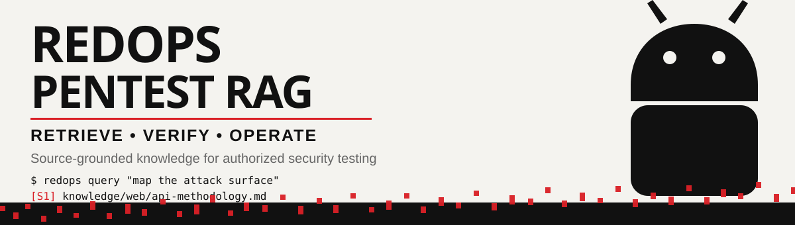

# RedOps / Red Team Operators

RedOps is a Makima-style OpenCode workspace for authorized penetration testing. Exegol supplies tools, Herdr keeps sessions, and the RedOps agent delegates to specialists. Knowledge is Markdown organized by niche, with original source URLs retained.

```text
Exegol · tools / binaries
└── Herdr · sessions
    └── OpenCode · AI harness
        └── RedOps · orchestrator
            ├── recon           ├── web-recon       ├── web-exploit
            ├── cve-research    ├── ad-enum         ├── ad-exploit
            ├── linux-privesc   ├── windows-privesc └── persistence
```

## Workspace

```text
AGENTS.md                    engagement and orchestration rules
.opencode/opencode.json      project config
.opencode/agent/             RedOps + 9 specialists
.opencode/command/           /solve and /status
.opencode/skill/             knowledge, toolbox, Herdr, scope, reporting
.opencode/tools.json         tools and MCP requirements by agent
knowledgebase/INDEX.md       niche-to-file map
knowledgebase/niches/        canonical Markdown corpus
knowledgebase/{PayloadsAllTheThings,InternalAllTheThings,HackerRecipes}/
                             source-oriented reference maps
precompiled-binaries/        operator-provided binaries, not committed
engagements/<name>/          private notes and artifacts
scripts/                     tool/MCP setup only
```

`knowledgebase/niches/api/` is optional user-provided book material. It is not committed; verify redistribution rights before publishing it.

## Setup

Install [OpenCode](https://opencode.ai/docs/), [Herdr](https://herdr.dev/), [Exegol](https://docs.exegol.com/), Git and Python 3. Docker must run for Exegol. From a checkout, run `bash scripts/install.sh`. Or use:

```sh
curl -fsSL https://raw.githubusercontent.com/alvinhayy/RedOps/master/scripts/install.sh | bash
```

The installer checks `.opencode/tools.json`, offers optional `exegol-mcp` installation via `pipx`, and writes only project-local, non-secret MCP configuration. It does **not** create a `redops` CLI, Python RAG service, or provider credentials, and it leaves global OpenCode provider/OAuth configuration untouched. Missing specialist tools can be supplied by Exegol or installed manually; exploit tooling is not silently installed.

Open the workspace with Herdr/OpenCode. Use `/solve` for an authorized target and `/status` to inspect readiness. RedOps reads the index, creates an engagement ledger, and delegates to specialists. See [AGENTS.md](AGENTS.md) for safety and evidence rules.

Start with [knowledgebase/INDEX.md](knowledgebase/INDEX.md). Cite the relevant document `source_url`; retrieval alone does not prove a technique works on a target. Never run active testing outside written scope or commit credentials, target loot, VPN profiles, or private engagement data.
