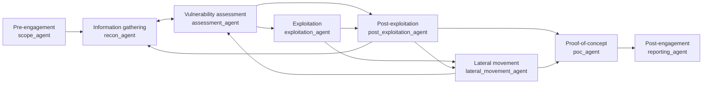

# RedOps engagement workflow

RedOps models an engagement as a phase-gated graph. The graph coordinates agents; it
does not grant authorization and it does not execute a target by itself.



## Handoff contract

Every phase passes only:

- the phase output and relevant artifacts;
- target scope and authorization basis;
- source-grounded citations and command output;
- open questions and explicit evidence gaps.

Credentials, tokens, cookies, private keys, raw identity exports, and unscoped target
identifiers are excluded from handoffs and the shared corpus.

## Gates

`pre_engagement` is mandatory. `exploitation`, `post_exploitation`, and
`lateral_movement` remain blocked until written scope, exact target allowlists, phase
approval, and Exegol/runtime health are confirmed. A scanner result or route plan is
never treated as proof that an exploit ran.

Use the read-only planner:

```bash
redops workflow "assess a Linux server"
```

The provider command `/redops-rag` uses the same planner, then routes technical work to
the narrowest niche agents (AD, web, mobile, Windows, Linux, cloud, and others).
