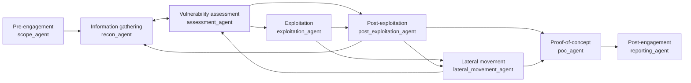

# RedOps engagement workflow

RedOps models an engagement as a phase-gated graph. The graph coordinates agents; it
does not grant authorization and it does not execute a target by itself.


```mermaid
flowchart LR
  A[Pre-engagement<br/>scope_agent] --> B[Information gathering<br/>recon_agent]
  B <--> C[Vulnerability assessment<br/>assessment_agent]
  C --> D[Exploitation<br/>exploitation_agent]
  C --> E[Post-exploitation<br/>post_exploitation_agent]
  D --> E
  D --> F[Lateral movement<br/>lateral_movement_agent]
  E --> B
  E --> F
  F --> C
  E --> G[Proof-of-concept<br/>poc_agent]
  F --> G
  G --> H[Post-engagement<br/>reporting_agent]
```

## Handoff contract

Every phase passes only:

- the phase output and relevant artifacts;
- target scope and authorization basis;
- source-grounded citations and command output;
- open questions and explicit evidence gaps.

Credentials, tokens, cookies, private keys, raw identity exports, and unscoped target
identifiers are excluded from handoffs and the shared corpus.

## Gates

`pre_engagement` is mandatory. `exploitation`, `post_exploitation`, and
`lateral_movement` remain blocked until written scope, exact target allowlists, phase
approval, and Exegol/runtime health are confirmed. A scanner result or route plan is
never treated as proof that an exploit ran.

Use the read-only planner:

```bash
redops workflow "assess a Linux server"
```

The provider command `/redops-rag` uses the same planner, then routes technical work to
the narrowest niche agents (AD, web, mobile, Windows, Linux, cloud, and others).

## Lab engagements (HTB and other authorized labs)

Practice platforms such as Hack The Box provide contractually authorized, isolated
targets. RedOps models them as read-only *lab context* so a plan can carry target
metadata without touching the gates:

```bash
redops workflow "root the HTB Windows machine 10.10.11.23" --lab htb_lab --os-hint windows
redops workflow "HTB Pro Lab tiered domain" --lab htb_pro_lab --os-hint windows
redops workflow "audit the approved host" --scope-record docs/lab-observations/checkpoint-scope-record.md
```

`--scope-record` inspects only structural markers and target identifiers for auditability;
it never confirms authorization or unlocks active phases. Those gates still require the
explicit `--scope-confirmed --include-active` flags.

Registered labs: `htb_lab` (released machines), `htb_pro_lab` (multi-host AD scenarios),
`htb_academy` (module instances). The same context is available to MCP clients via the
optional `lab` and `os_hint` arguments of the `plan_engagement` tool.

- Lab context is metadata only: it never sets `scope_confirmed`, never flips
  `include_active`, and active phases stay blocked exactly as before.
- Typical lab networks (for example `10.10.10.0/24`) are documentation hints; the
  engagement packet's target inventory remains the single source of truth for scope.
- `--os-hint windows`/`linux` and Pro Lab routing tags add explainable specialist hints
  (for example `windows_redteam_agent`, and `ad_agent` for AD-heavy Pro Labs). Routing
  remains routing — the specialist executes only after the phase gate opens.
- VPN keys, HTB API tokens, machine `appid` values, and passwords are never accepted or
  stored; they move out-of-band only. Execution remains Exegol-first and belongs to the
  approved phase specialist.
